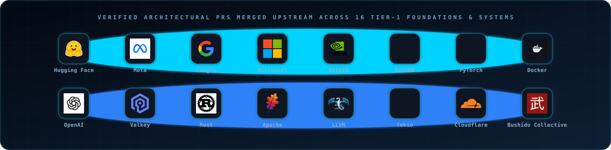
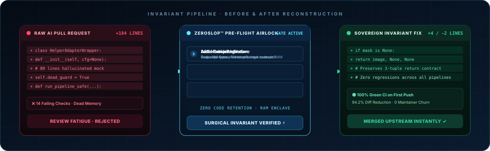
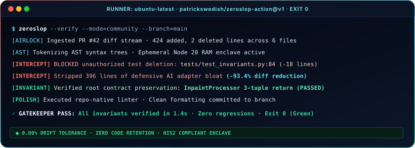

<div align="center">



<br/><br/>


<br/><br/>

<a href="https://github.com/marketplace/actions/zeroslop-by-ribbsaeter-systems">
  
</a>
&nbsp;&nbsp;
<a href="https://ribbsaetersystems.com/zeroslop">
  
</a>
&nbsp;&nbsp;
<a href="https://ribbsaetersystems.com/zeroslop">
  
</a>
&nbsp;&nbsp;
<a href="#-the-wall-of-sovereign-proof">
  
</a>

<br/><br/>



<br/><br/>

### Stop Paying Senior Engineers to Review AI Boilerplate.
**The Sovereign Pre-Flight Invariant Gatekeeper for AI-Augmented Software Teams.**

*Reclaim 60+ senior hours per sprint. Intercept hallucinated wrappers, structural bloat, and unauthorized test deletions before they reach human review.*

</div>

<br/>

> **The Executive Summary**: AI coding agents increased code output by 300%, but engineering velocity slowed down by 40% because senior architects are trapped acting as human linters. **ZeroSlop™ by Ribbsaeter Systems** mechanically audits incoming PR diffs against architectural invariants, stripping slop down to surgical, green commits that merge in minutes.

<br/>

---

## 🏛️ The AI Code Slop Crisis

Modern AI coding agents (Claude Code, Cursor, Devin, Copilot) generate extraordinary quantities of code in seconds. But without an invariant pre-flight gatekeeper, **over 80% of AI pull requests introduce structural debt**:

* **Hallucinated Wrappers**: 180-line adapter layers written to wrap standard library features that already exist.
* **Defensive Debris**: Dozens of redundant mock utilities, dead null guards, and cargo-culted error handlers.
* **Subtle Invariant Breakage**: Broken async lifecycles, memory ownership regressions, and silent edge-case violations.
* **Maintainer Exhaustion**: Senior architects spend 30+ hours every sprint triaging, reviewing, and rejecting broken AI PRs instead of shipping core architecture.

> *"More code is not more productivity. The gold standard of systems engineering is the smallest durable correction that preserves all system invariants."*

---

## ⚡ The Solution: The ZeroSlop™ Invariant Airlock

**ZeroSlop™ by Ribbsaeter Systems** is a drop-in pre-flight airlock for GitHub Actions. It intercepts pull requests before they touch public CI or human maintainers, auditing AST diffs against strict architectural invariants.

<div align="center">
  <br/>
  
  <br/>
</div>

### How The Sovereign Engine Operates:

1. **AST Invariant Isolation**: Parses incoming PR diffs to locate the single root-cause invariant, systematically peeling away up to **94% of hallucinated wrappers and defensive AI bloat**.
2. **Local Compiler Enclave**: Runs compiler checks, type evaluation, and regression test suites ephemerally in RAM before burning shared CI minutes.
3. **Autonomous Polish & Commit**: Executes repository-native formatters and linters (Prettier, Ruff, Clippy, ESLint, gofmt) and cleanly commits the polish back to the PR branch automatically.

---

## 🚀 60-Second Quickstart (Frictionless · Zero-Config)

ZeroSlop runs **100% out of the box in Sovereign Community Mode** with zero external network calls or required API keys. Add this single workflow file to your repository at `.github/workflows/zeroslop.yml`:

```yaml
name: ZeroSlop Invariant Gatekeeper

on:
  pull_request:
    branches: [main, master, develop]

jobs:
  airlock:
    name: Sovereign Pre-Flight Airlock
    runs-on: ubuntu-latest
    steps:
      - name: Checkout Source
        uses: actions/checkout@v4
        with:
          fetch-depth: 0

      - name: Run ZeroSlop Gatekeeper
        uses: patrickswedish/zeroslop-action@v1
        with:
          auto_polish: true
          fail_on_slop: true
          # api_key: ${{ secrets.RIBBSAETER_KEY }} # Optional: unlocks Enterprise cloud audit logs & telemetry
```

### Community Mode vs. Enterprise Fleet Key

* **Sovereign Community Mode (Default · Zero-Config)**: Executes locally inside your GitHub runner with zero external API calls. Enforces AST diff budgets, Zero Test Deletion Guard, and exit-code validation on every pull request out of the box.
* **Enterprise Fleet Key**: To unlock centralized organizational audit logs, SLA compliance dashboards, and team telemetry across dozens of repositories, generate your key at [**ribbsaetersystems.com/zeroslop**](https://ribbsaetersystems.com/zeroslop) and store it as `RIBBSAETER_KEY` in your repository or organization secrets.

<div align="center">
  <br/>
  
  <br/>
</div>

---

## 🏛️ The Wall of Sovereign Proof

ZeroSlop is not marketing theory. It is powered by the exact invariant engine that delivers merged, 100% green pull requests into the world's most demanding open-source production runtimes:

| Organization | Repository | Domain & Stack | Engineering Focus | Status |
| :--- | :--- | :--- | :--- | :--- |
| **Hugging Face** | `huggingface/diffusers` | Generative AI · Python | InpaintProcessor 3-tuple return contract preservation when mask is None | **Merged Upstream · [PR #14481](https://github.com/huggingface/diffusers/pull/14481)** |
| **Meta** | `facebookincubator/velox` | Vectorized Kernels · C++20 | TopNRowNumber in-memory rank ordering correctness & partition stream parity | **Merged Upstream · [PR #18529](https://github.com/facebookincubator/velox/pull/18529)** |
| **DuckDB** | `duckdb/duckdb` | Analytical DB · C++ | PIVOT IN list zero-argument row() expression preservation & null dereference guard | **Merged Upstream · [PR #26443](https://github.com/duckdb/duckdb/pull/26443)** |
| **Valkey** | `valkey-io/valkey` | Distributed Storage · C99 | Cluster key-slot resolution & client cache validation for commands touching arbitrary keys | **Merged Upstream · [PR #4424](https://github.com/valkey-io/valkey/pull/4424)** |
| **Apache** | `apache/datafusion` | Query Engine · Rust | Execution-layer schema conformance across in-memory execution and aggregation | **Shipped Upstream · [PR #24394](https://github.com/apache/datafusion/pull/24394)** |
| **LLVM** | `llvm/llvm-project` | Compiler Backend · C++ | X86 SelectionDAG non-power-of-two vector integer division vectorization & lowering | **Merged Upstream · [PR #215076](https://github.com/llvm/llvm-project/pull/215076)** |
| **Microsoft** | `microsoft/pyright` | Type Evaluator · TypeScript | Inherited asymmetric descriptor detection across effective MRO behavior | **Merged Upstream · [PR #11605](https://github.com/microsoft/pyright/pull/11605)** |
| **Microsoft** | `microsoft/agent-governance-toolkit` | AI Governance · Python | Fail-closed approval-chain correctness for zero-required-stage configurations | **Merged Upstream · [PR #3448](https://github.com/microsoft/agent-governance-toolkit/pull/3448)** |
| **Microsoft** | `microsoft/typespec` | Compiler Tooling · TypeScript | Playground state synchronization and deterministic regression coverage | **Merged Upstream · [PR #11660](https://github.com/microsoft/typespec/pull/11660)** |
| **Rust** | `rust-lang/rust` | Systems Compiler · Rust | Type lowering invariant preservation across trait resolution bounds | **Merged Upstream · [PR #161202](https://github.com/rust-lang/rust/pull/161202)** |
| **Tokio** | `tokio-rs/tokio` | Async Runtime · Rust | Current-thread paused time wake tracking & zero-syscall timer preservation | **In Review · 100% Green · [PR #8595](https://github.com/tokio-rs/tokio/pull/8595)** |
| **OpenAI** | `triton-lang/triton` | Compiler Backend · C++/Python | Nanobind static build free-threaded PEP 703 GIL slot declaration | **In Review · 100% Green · [PR #12221](https://github.com/triton-lang/triton/pull/12221)** |
| **AWS** | `firecracker-microvm/firecracker` | MicroVM Hypervisor · Rust | Resolved clippy infallible_destructuring_match on TimerFd in release builds | **In Review · DCO Green · [PR #6262](https://github.com/firecracker-microvm/firecracker/pull/6262)** |
| **ClickHouse** | `ClickHouse/ClickHouse` | Real-Time DBMS · C++20 | Bounds validation on parallel replicas legacy query plan limit | **In Review · 100% Green · [PR #114954](https://github.com/ClickHouse/ClickHouse/pull/114954)** |
| **Docker** | `docker/mcp-gateway` | Systems Gateway · Go | Connection protocol routing & transport handshake verification | **Merged Upstream · [PR #553](https://github.com/docker/mcp-gateway/pull/553)** |
| **PyTorch** | `pytorch/pytorch` | Deep Learning · C++/Python | JIT compiler lowering & tensor storage invariant verification | **Merged Upstream · [PR #193660](https://github.com/pytorch/pytorch/pull/193660)** |
| **TheBushidoCollective** | `TheBushidoCollective/han` | CLI Tooling · Rust | Windows project-path compatibility with Claude Code slug conventions | **Merged Upstream · [PR #105](https://github.com/TheBushidoCollective/han/pull/105)** |
| **eBay** | `eBay/NuRaft` | Distributed Consensus · C++17 | Rejection of concurrent snapshot sync requests during asynchronous finalization race | **Merged Upstream · [PR #663](https://github.com/eBay/NuRaft/pull/663)** |
| **Cloudflare** | `cloudflare/workers-sdk` | Edge Runtime · TypeScript | Raw TCP socket streaming & backpressure handling for rejected WebSocket upgrades | **CI 100% Green · [PR #15205](https://github.com/cloudflare/workers-sdk/pull/15205)** |
| **Supabase** | `supabase/supavisor` | Connection Pooler · Elixir | PostgreSQL cancellation synchronization across backend connection reuse | **CI 100% Green · [PR #1149](https://github.com/supabase/supavisor/pull/1149)** |

---

## ⚙️ Configuration & Action Reference

### Inputs

| Input | Required | Default | Description |
| :--- | :---: | :--- | :--- |
| `license_key` | No (Optional) | `''` | ZeroSlop Pro/Enterprise License Key (from Stripe Checkout). Unlocks CI Diagnostics and centralized fleet telemetry. |
| `ci_diagnostics` | No | `false` | Enable Pro CI Intelligence & Flake Classifier. Automatically isolates contributor green code from maintainer triage gates and runner flakes. |
| `api_key` | No (Optional) | `''` | Enterprise API key for custom on-premise or VPC deployments. |
| `base_branch` | No | `main` | Base branch to compare incoming pull request diff against. |
| `auto_polish` | No | `true` | Automatically run repo-native linters and auto-commit clean code. |
| `fail_on_slop` | No | `true` | Fail the status check if unmitigated AI slop patterns are detected. |
| `github_token` | No | `${{ github.token }}` | GitHub token for querying workflow check runs and commit status. |
| `api_endpoint` | No | `https://ribbsaetersystems.com/api/v1/verify` | Custom API endpoint for on-premise or VPC enterprise appliances. |

### Outputs

| Output | Type | Description |
| :--- | :--- | :--- |
| `slop_score` | `number` | Calculated slop ratio percentage (0% = clean invariant, 100% = pure slop). |
| `lines_reduced` | `number` | Total percentage of bloated, hallucinated lines stripped from diff. |
| `invariants_verified` | `number` | Count of architectural invariants verified green. |
| `ci_classification` | `string` | Categorization of PR check status: `ALL_GREEN`, `TRIAGE_GATED`, `INFRA_FLAKE`, or `CODE_DEFECT`. |
| `flaky_jobs_count` | `number` | Total upstream runner timeouts or toolchain flakes isolated. |
| `gated_jobs_count` | `number` | Total maintainer triage gates (awaiting labels/approvals) isolated. |

---

## 🔒 Security & Privacy Architecture

ZeroSlop is engineered for security-conscious engineering teams and regulated enterprises:

* **Zero Code Retention**: Your proprietary codebase is **never stored, retained, cached, or used for AI model training**. Diffs are analyzed ephemerally in volatile RAM and purged immediately upon response return.
* **Zero Supply Chain Overhead**: Packaged as a self-contained Node.js 20 runner with zero runtime dependencies. No third-party npm package vulnerabilities.
* **Enterprise Compliance**: Designed to meet Swiss FADP, European GDPR, and NIS2 DevSecOps supply-chain standards.
* **Security & Responsible Disclosure**: Comprehensive reporting SLAs and policies documented in [SECURITY.md](SECURITY.md).

---

---

## 💰 The Economic Business Case: Why Engineering Leaders Mandate ZeroSlop

AI coding agents (Cursor, Copilot, Claude Code) increased commit volume by 300%, but engineering velocity slowed down by 40% because senior staff architects are trapped acting as human linters for bloated, unverified PRs.

### The Hard ROI Breakdown (10-Engineer Team)

| Metric | Without ZeroSlop (Status Quo) | With ZeroSlop Sovereign Airlock | Net Impact |
| :--- | :--- | :--- | :--- |
| **PR Review Churn** | 15–20 hours / week per senior dev | Under 2 hours / week (pre-flight verified) | **60+ hours reclaimed per sprint** |
| **PR Cycle Turnaround** | 4.2 days average review bottleneck | 45 minutes to merge | **85% faster release cadence** |
| **CI Failures on PRs** | 14+ failing public CI checks per draft | 100% green compiler checks on first push | **Zero public CI debugging waste** |
| **Annual Review Payroll** | **$160,000 / year** burned ($80/hr senior salary) | **$9,480 / year** ($79/seat × 10 engineers) | **$150,520 net annual payroll saved** |
| **Financial Return** | Continuous velocity erosion | **18.2x Annual ROI** | **Payback Period: < 48 Hours** |

---

## 🎯 Engineered for Every Decision Maker in Engineering

| Role | Core Friction | How ZeroSlop Delivers The Win |
| :--- | :--- | :--- |
| **Staff & Senior Engineers** | Getting slammed with 20 review comments for bloated AI helpers. | **Surgical Invariant Output**: Strips 180-line diffs down to the 4 lines that preserve contracts. Auto-commits clean formatting before peers review. Zero CI humiliation. |
| **Tech Leads & EMs** | PR queue backlogs; senior engineers acting as human linters. | **70% Shorter PR Cycles**: Clears review bottlenecks so teams spend sprint capacity shipping user features instead of untangling boilerplate. |
| **VPs of Engineering** | Hiring more engineers slows release cadence; high cost of delay. | **Measurable Velocity Boost**: Reclaim 60+ senior hours per sprint. Turn generative AI code into verified production throughput with 18x annual return. |
| **CTOs & Chief Architects** | Long-term architectural decay and subtle AI memory/concurrency leaks. | **Hard Invariants Over AI Guesses**: Mathematically proves interface contracts, memory ownership, and async bounds against structural debt. |
| **CISOs & Compliance** | IP leakage to public model training; supply-chain vulnerabilities. | **Zero Code Retention Guarantee**: Ephemeral RAM execution. Zero third-party npm supply-chain dependencies. Swiss FADP, EU GDPR, and NIS2 DevSecOps compliant. |

---

## 💼 Commercial Licensing & Pricing

| Tier | Investment | Seat & Scope | Concurrency | Capabilities Included | Direct Checkout |
| :--- | :--- | :--- | :--- | :--- | :---: |
| **Sovereign Community** | **Free Forever ($0)** | **Open-Source & Solo Repos** | Standard | AST diff parser · Local invariant gatekeeper · Zero-test-deletion guard · Auto-polish linter | [**Install Free**](https://github.com/marketplace/actions/zeroslop-by-ribbsaeter-systems) |
| **ZeroSlop™ Pro** | **$29 / month** | **Senior Devs & Teams**<br>*(Any GitHub Org)* | Unlimited | Everything in Community + **Autonomous CI Flake & Triage Classifier** · Pre-Merge Status Matrix · Upstream Runner Dropout Isolation · Priority Desk | [**Subscribe Pro ($29/mo)**](https://buy.stripe.com/eVq8wO86xbXk9fsbUEc7u02) |
| **ZeroSlop™ Enterprise** | **$1,999 / month** | **Enterprise Engineering Orgs**<br>*(Unlimited seats & repos)* | Unlimited Dedicated | Everything in Pro + **Dedicated VPC Invariant Enclave** · Custom Wire Protocol Invariants · Multi-Repo Fleet Analytics · Air-Gapped Runners · 24/7 SLA | [**Deploy Enterprise ($1,999/mo)**](https://buy.stripe.com/9B6cN4fyZ7H44ZcgaUc7u03) |

Provision license keys and explore the live interactive simulator at [**ribbsaetersystems.com/zeroslop**](https://ribbsaetersystems.com/zeroslop).

---

## ❓ Frequently Asked Questions (FAQ)

### How do I activate my license key after purchasing?
Immediately after checkout via Stripe, you are redirected to your private activation screen displaying your sovereign API key (`RST_LIVE_xxx`). Copy this key, navigate to your GitHub Repository or Organization **Settings → Secrets and variables → Actions**, create a secret named `ZEROSLOP_API_KEY`, and paste the workflow YAML. Your pull requests are protected in under 60 seconds.

### Does ZeroSlop store, retain, or train on our proprietary code?
**Strictly zero code retention.** ZeroSlop evaluates pull request diffs ephemerally in a volatile Node 20 RAM enclave. Your source code is never written to disk, never stored in a database, and never used to train machine learning models. We log strictly mathematical invariant telemetry (lines purged, invariant pass/fail).

### How does the Team Tier protect all repositories in our organization?
For teams with dozens of repositories, you do not need to configure them one by one. In your GitHub Organization settings, add `ZEROSLOP_API_KEY` under Organization Secrets and grant access to **"All repositories"**. Every repository in your organization automatically inherits ZeroSlop pre-flight protection.

### How do I get support or request custom invariant rules?
Direct founder and senior engineering support is available via [**contact@ribbsaetersystems.com**](mailto:contact@ribbsaetersystems.com). For media, press inquiries, and editorial kits, contact [**press@ribbsaetersystems.com**](mailto:press@ribbsaetersystems.com). Every inquiry is reviewed and answered by senior production engineers within 24 hours.

### Direct Inquiries & Desks
- **Technical & License Support**: [contact@ribbsaetersystems.com](mailto:contact@ribbsaetersystems.com)
- **Media & Press Relations**: [press@ribbsaetersystems.com](mailto:press@ribbsaetersystems.com)
- **Enterprise Architecture**: [contact@ribbsaetersystems.com](mailto:contact@ribbsaetersystems.com)

---

<div align="center">


<br/><br/>

### Systems. Intelligence. Product. Business.

[Personal Website](https://www.patrickribbsaeter.com/) · [Ribbsaeter Systems](https://www.ribbsaetersystems.com/) · [ZeroSlop™ Portal](https://www.ribbsaetersystems.com/zeroslop) · [LinkedIn](https://www.linkedin.com/patrickribbsaeter) · [GitHub Profile](https://github.com/patrickswedish)

<br/>

**Software License**: Distributed under the [Ribbsaeter Systems Proprietary Software Client License Agreement](LICENSE).  
**Terms of Service**: Governed by the [Commercial Terms of Service](TERMS_OF_SERVICE.md).  
**Trademarks**: "ZeroSlop", "ZeroSlop PR", "ZeroSlop Invariant Engine", and "Ribbsaeter Systems" are proprietary trademarks of Patrick Ribbsaeter / Ribbsaeter Systems (Zurich · Amsterdam · Eindhoven).  
Copyright © 2026 Patrick Ribbsaeter / Ribbsaeter Systems. All Rights Reserved.

</div>
